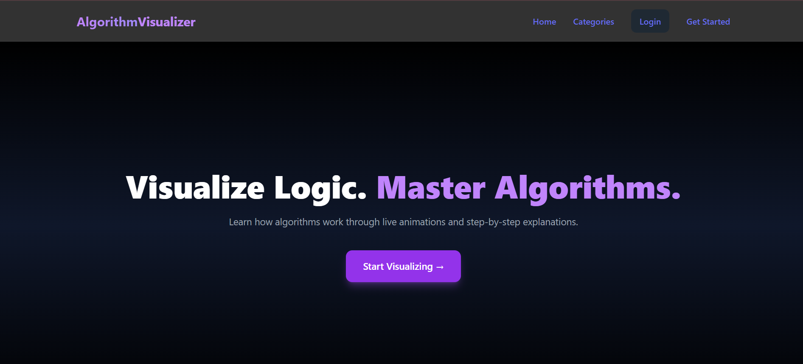
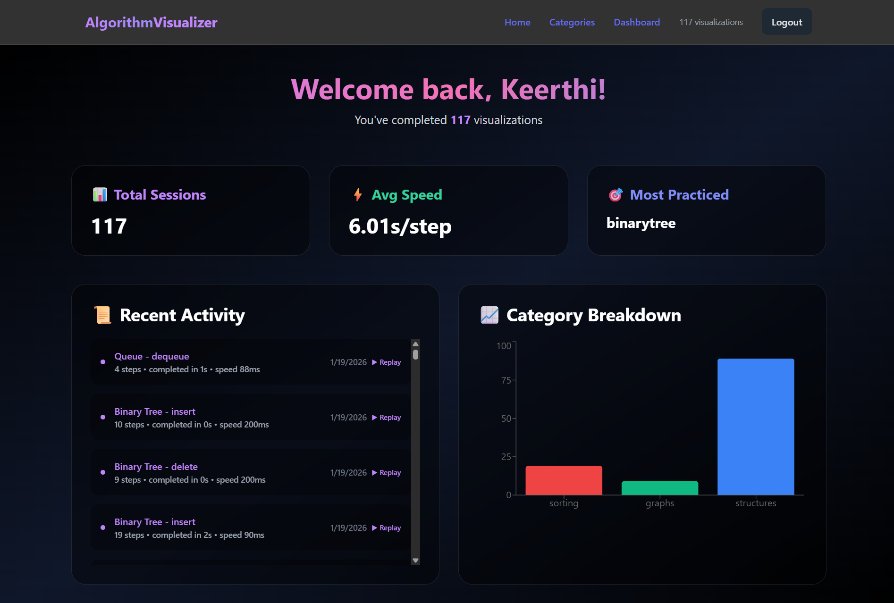
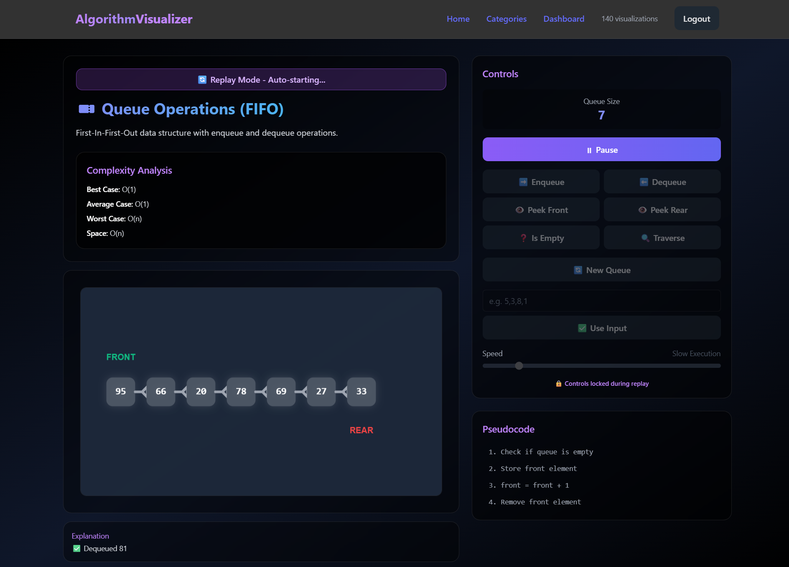

# 🧠 Algorithm Visualizer

An interactive full-stack web application for visualizing algorithms and data structures through real-time animations and step-by-step explanations.

Built to help developers and students deeply understand how algorithms work — not just what they do.

---

# ✨ Features

## 📚 Algorithms & Data Structures

| Category | Algorithms / Structures |
|-----------|--------------------------|
| **Sorting** | Bubble Sort, Selection Sort, Insertion Sort, Merge Sort, Quick Sort |
| **Graph** | BFS, DFS, Dijkstra's Shortest Path |
| **Data Structures** | Stack, Queue, Linked List, Binary Tree, Binary Heap |

---

## 🎛 Visualizer Features

- Step-by-step animated execution with adjustable speed  
- Pseudocode panel synchronized with each step  
- Complexity panel (Time & Space complexity for each algorithm)  
- Algorithm info and explanation panels  
- Control panel per algorithm/structure with input forms  
- Randomized data generation for sorting and graphs  

---

## 👤 User Features

- JWT-based authentication (Register / Login)  
- Protected dashboard route  
- Visualization history saved to the database  
- Replay any past visualization session  
- Progress tracking per algorithm and category  
- Category breakdown bar chart (Recharts)  

---

# 🛠 Tech Stack

## 🛠 Tech Stack

**Frontend:** React.js, HTML, CSS, JavaScript, React Router  
**Backend:** Node.js, Express.js  
**Database:** MongoDB  
**Authentication:** JWT  
**State Management:** Zustand  
**Styling:** Tailwind CSS  
**Charts & Visualization:** Recharts  
**Animations:** Framer Motion  
**Build Tool:** Vite  
---

# 🌐 Live Demo

🔗 **Live Application:**  
👉 https://your-live-demo-link.com

---

# 📸 Screenshots

## 🏠 Home Page

```markdown

```

---

## 📊 Sorting Visualization

```markdown

```

---

## 🌐 Graph Visualization

```markdown

```

---

## 📚 Pseudocode & Complexity Panel

```markdown

```

---

## 📈 Dashboard (Progress & History)

```markdown

```

---

## 🔄 Replay Visualization

```markdown

```
